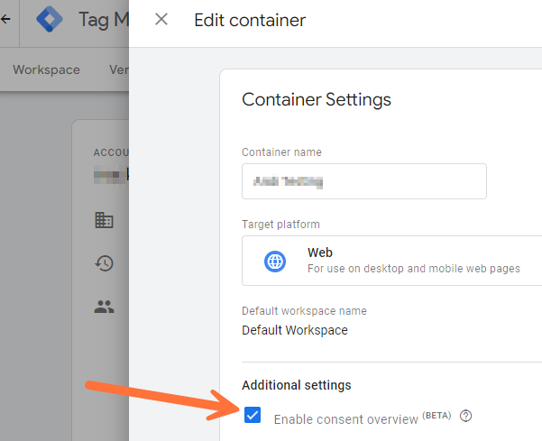
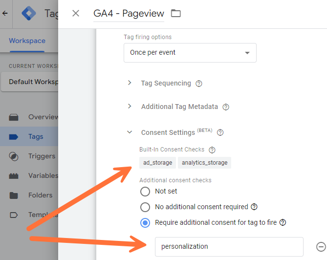

# trTMlib.js - Library for easy use GTM and/or GTAG #
*trTMlib*


## Table of Contents ##

- [What is it for? - General Information](#what-is-it-for----general-information)
- [Usage](#usage)
- [Configuration options](#configuration-options)
- [Consent Handling](#consent-handling)
- [Sending Events only to GTM or only to GTAG](#sending-events-only-to-gtm-or-only-to-gtag)
- [Debugging](#debugging)
- [Frequently Asked Questions (FAQ)](#frequently-asked-questions--faq-)
- [Author and Contact](#author-and-contact)
- [Changelog](#changelog)


## What is it for? - General Information ##

trTMlib can help you to make your live easier, if you use the Google Tag Manager depending on user consent.

### In short ###
The “trTMlib” provides functions for an easier and more data privacy friendly integration/handling of Google Tag Manager and GTAG, together (or without) with the Google Consent Mode. GTM will not be fired before or without consent.

### Something more detailed ###
Handling Google Tag Manager / GTAG and (cookie) consent is often very tiring and frustrating.
Especially when, for example, eCommerce events come into the GTM dataLayer, but the consent information only comes later, the setup in Google Tag Manager becomes difficult.
If there is also a requirement to use Google Consent Mode with GTM, further problems arise.
This Javascript library replaces the normal code to integrate the Google Tag Manager and/or GTAG into the website.
The advantage is that the (cookie) consent information is already available before the Google Tag Manager is loaded. Or (in other words) the Google Tag Manager is only loaded when the consent is available. And (depending on the configuration) only if the visitor has agreed to the delivery of the GTM in the consent banner - so it is also a very data protection-friendly solution.
In any case, with the GTM setup you no longer have to worry about whether and when the consent is available, but can take care of the actual setup.

### Even more information ###
Feel free to use or change the code. If you have suggestions for improvement, please write to me.
**Licence:** MIT License
**Repository:** [Github trTMlib Repository](https://github.com/Andiministrator/trTM)


## Usage ##

Some help for the usage of trTMlib:

### Complete short integration code example ###
Before you include the code to your website (template), you need to upload the necessary files. In this code example it was uploaded to the public directory /js/.
*For Consentmanager and without consent mode support*:
```html
<script src="/js/trTMlib.min.js" type="text/javascript"></script>
<script src="/js/trTMcmp/consent_check_consentmanager.js" type="text/javascript"></script>
<script type="text/javascript">
trTM.f.config({
   gtmID: 'GTM-XYZ123'
  ,gtmPurposes:'Funktional'
  ,gtmServices:'Google Tag Manager'
});
trTM.f.tm_inject();
</script>
```
Notice: You need to change the function for the consent check, see below how. Also you need to change the config, see below.

### Usage in explained steps ###

1. **Upload the necessary files**
   Upload the necessary files, that means at least the library itself (trTMlib.js or the minified version trTMlib.min.js) and the consent check function file regarding to your CMP (Consent Tool). In the code example above, the files were uploaded to the public directory /js/ (we used the minified version) and the Consent Tool is Consent Manager (file consent_check_consentmanager.js and uploaded it in the subdirectory "trTMcmp").
   We recommend also to upload the file "trTMlib_debug.js". It contains some useful options to debug trTMlib in case of problems.

2. **Include the trTMlib.js to your HTML code, e.g. in the HTML head (recommendation: use the minified version)**
   `<script src="/js/trTMlib.min.js" type="text/javascript"></script>`

3. **Add your settings (within a javascript block)**
   Example with many settings:
   ```javascript
   trTM.f.config({
      gtmID: 'GTM-XYZ123' // your GTM Container ID - leave it empty if you don't want to the Google Tag Manager
     ,gtmPurposes: 'Functional' // The purpose(s) that must be agreed to in order to activate the GTM (comma-separated)
     ,gtmServices: 'Google Tag Manager' // The services(s) that must be agreed to in order to activate the GTM (comma-separated), e.g. 'Google Tag Manager'
     ,gtmVendors: 'Google Inc' // The vendor(s) that must be agreed to in order to activate the GTM (comma-separated)
     ,gtag: { 'G-1234567': { debug_mode:true, send_page_view:false } } // GTAG(s) with config - set it to null if you don't want to use GTAG functionallity, example: cfg.gtag = { 'G-xxx': { debug_mode:true, send_page_view:false } };
     ,gtagPurposes: 'Marketing' // The purpose(s) that must be agreed to in order to activate the GTAG (comma-separated)
     ,gtagServices: 'Google Analytics' // The services(s) that must be agreed to in order to activate the GTAG (comma-separated), e.g. 'Google Analytics'
     ,gtagVendors: 'Google Inc' // The vendor(s) that must be agreed to in order to activate the GTAG (comma-separated)
     ,gdl: 'dataLayer' // Name of GTM dataLayer
     ,env: '' // Environment string (leave it blank you you don't know, what it is)
     ,useListener: false, // Use an event listener to check the consent (true). If it is false, a timer will be used (default) to check the consent
     ,consent: {
        hasResponse:false // true (or string) if consent was given, false if consent was not (yet) given (user hasn't interacted with the consent banner)
       ,consent_events: 'cmpEvent,cmpUpdate'; // string with consent events (comma-separated) for updating the consent (leave it blank you you don't know, what it is)
       ,consent_id:'' // ID of the current CMP User to request consent info
       ,feedback:'' // contains a string with a CMP info about whether/how the consent was given - this is tracked as event through the tracking library
       ,purposes:'' // contains a string with the acknowledged consent purposes
       ,services: '' // contains a string with the acknowledged consent services
       ,vendors:'' // contains a string with the acknowledged consent vendors
       ,cm:true // use the (Gtag) Consent Mode Function
       ,gtagmap:{ // Mapping for GTAG/GTM integrated Consent Functions - set it to NULL if is not needed
          ad_storage: { status:'denied', purposes:['marketing'], services:['Google Ads'], vendors:['Google Inc'] } // Enables storage, such as cookies, related to advertising
         ,ad_user_data: { status:'granted', purposes:['necessary'], services:[], vendors:[] } // Sets consent for sending user data to Google for advertising purposes
         ,analytics_storage: { status:'denied', purposes:['analytics'], services:['Google Analytics'], vendors:['Google Inc'] } // Enables storage, such as cookies, related to analytics (for example, visit duration)
         ,ad_personalization: { status:'granted', purposes:['necessary'], services:[], vendors:[] } // Sets consent for personalized advertising.
                                                                                                    // Note: Disabling personalized advertising using [allow_ad_personalization_signals](https://support.google.com/google-ads/answer/9606827?sjid=10512473389493160849-EU), yields the same results as using ad_personalization. If you set both parameters with conflicting values, personalization is disabled. To honor user choices, implement ad_personalization.
         ,analytics_audiences: { status:'denied', purposes:['personalization'], services:['Google Analytics'], vendors:['Google Inc'] } // Enables storage, such as cookies, related to analytics (for example, visit duration)
         ,personalization_storage: { status:'denied', purposes:['marketing'], services:[], vendors:['Google Ads'] } // Enables storage related to personalization such as video recommendations
         ,functionality_storage: { status:'denied', purposes:['functional'], services:[], vendors:[] } // Enables storage that supports the functionality of the website or app such as language settings
         ,security_storage: { status:'granted', purposes:['necessary'], services:[], vendors:[] } // Enables storage related to security such as authentication functionality, fraud prevention, and other user protection
       }
     }
   });
   ```

4. **Add the consent check function depending on your consent tool - look for the right file in folder trTMcmp**
   Example for the consent tool "Consentmanager":
   `<script src="/js/trTMcmp/consent_check_consentmanager.js" type="text/javascript"></script>`
   *Notice: Instead including the external script, you could also put the function direct into trTMlib.js and overwrite the function(s) with the same name*
   Available consent tool functions:
   - Borlabs Cookie: consent_check_borlabs.js
   - CCM19: consent_check_ccm19.js
   - Consentmanager: consent_check_consentmanager.js
   - Cookiebot: consent_check_cookiebot.js
   - Cookie First: consent_check_cookiefirst.js
   - Klaro: consent_check_klaro.js
   - Sourcepoint: consent_check_sourcepoint.js
   - Usercentrics: consent_check_usercentrics.js

5. **Start the injection (within the same javascript block from above)**
   ```javascript
   trTM.f.tm_inject();
   ```

6. **Send events**
   You can now send events using the following command:
   ```javascript
   trTM.f.fire({ event:'button_click', button:'Sign Up Button', gtm:true, gtag:false });
   ```


## Configuration options ##

There are a lot configuration options. But you need only to use the options, where you want another setting as the default value.

### useListener ###
Use an event listener to check the consent (true). If it is false, a timer will be used (default) to check the consent.
You should add the following command to your Consent Event Listener:
`trTM.f.consent_event_listener();`
*Make sure, that the trTM lib is loaded before the event listener runs!*
If you don't know what that means, leave this option to false (default).
For more information, read the chapter "[Use Event Listeners instead of the default timer](#use-event-listeners-instead-of-the-default-timer)".
Type: boolean
Example: `true`
Default: `false`

### gtmID ###
your GTM Container ID - leave it empty if you don't want to use the Google Tag Manager
Type: string
Example: `'GTM-XYZ123'`
Default: `''`

### gtmPurposes ###
The purpose(s) that must be agreed to in order to activate the GTM (comma-separated)
Type: string
Example: `'Functional'`
Default: `''`

### gtmServices ###
The services(s) that must be agreed to in order to activate the GTM (comma-separated)
Type: string
Example: `'Google Tag Manager'`
Default: `''`

### gtmVendors ###
The vendor(s) that must be agreed to in order to activate the GTM (comma-separated)
Type: string
Example: `'Google Inc'`
Default: `''`

### gdl ###
Name of GTM dataLayer
Type: string
Example: `'dataLayer'`
Default: `'dataLayer'`

### env ###
Environment string (leave it blank you you don't know, what it is)
Type: string
Example: `'&gtm_auth=ABC123xyz&gtm_preview=env-1&gtm_cookies_win=x'`
Default: `''`

### gtag ###
GTAG(s) with config - set it to null if you don't want to use GTAG functionallity, example: cfg.gtag = { 'G-xxx': { debug_mode:true, send_page_view:false } };
Type: object
Example: `{ 'G-xxx': { debug_mode:true, send_page_view:false } }`
Default: `null`
Find some documentation for the GTAG here: [GTAG Developer Information](https://developers.google.com/tag-platform/gtagjs/reference?hl=de)

### gtagPurposes ###
The purpose(s) that must be agreed to in order to activate the GTAG (comma-separated)
Type: string
Example: `'Marketing'`
Default: `''`

### gtagServices ###
The service(s) that must be agreed to in order to activate the GTAG (comma-separated)
Type: string
Example: `'Google Analytics'`
Default: `''`

### gtagVendors ###
The vendor(s) that must be agreed to in order to activate the GTAG (comma-separated)
Type: string
Example: `'Google Inc'`
Default: `''`

### consent ###
An object with consent information that should be set by default (if no consent is given or not yet).
Type: object
Example:
```javascript
{
   purposes:''
  ,vendors:''
  ,consent_events:'cmpEvent'
  ,cm:true
  ,gtagmap:{
     ad_storage: { status:'denied', purposes:['marketing'], services:['Google Ads'], vendors:['Google Inc'] }
    ,ad_user_data: { status:'denied', purposes:['necessary'], services:[], vendors:[] }
    ,analytics_storage: { status:'denied', purposes:['statistics'], services:['Google Analytics'], vendors:['Google Inc'] }
    ,ad_personalization: { status:'denied', purposes:['necessary'], services:[], vendors:[] }
    ,personalization_storage: { status:'denied', purposes:['personalization'], services:[], vendors:[] }
    ,functionality_storage: { status:'denied', purposes:['functional'], services:[], vendors:[] }
    ,security_storage: { status:'denied', purposes:['necessary'], services:[], vendors:[] }
  }
}
```
Default: No Response, no feedback, no purposes, no vendors and all stati of the storage options are set to denied
As you can see above, the object contains different configuration options, which are descriped as follow:

#### purposes ####
contains a string with the acknowledged consent purposes
Type: string
Example: `',cart_storage,consent_banner,'`
Default: `''`

#### services ####
contains a string with the acknowledged consent services
Type: string
Example: `',A Statistic Tool,'`
Default: `''`

#### vendors ####
contains a string with the acknowledged consent vendors
Type: string
Example: `',Consent Vendor,'`
Default: `''`

#### consent_events ####
string with consent events (comma-separated) for updating the consent
For more Information, read the chapter [Updating Consent Information](#updating-consent-information)
Type: string
Example: `'cmpEvent,cmpUpdate'`
Default: `''`

#### cm ####
use the (Gtag) Consent Mode Function
Type: boolean
Example: `true`
Default: `false`

#### gtagmap ####
Mapping for GTAG/GTM integrated Consent Functions - set it to {} if is not needed or you don't know what it is
Type: object
Example: see example above under consent
Default: see example above under consent

##### ad_storage #####
Enables storage, such as cookies, related to advertising
Type: object
Example: `{ status:'denied', purposes:['marketing'], services:['Google Ads'], vendors:['Google Inc'] }`
Default: `{ status:'denied', purposes:[], services:[], vendors:[] }`

##### ad_user_data #####
Sets consent for sending user data to Google for advertising purposes
Type: object
Example: `{ status:'denied', purposes:['necessary'], vendors:['My Company'] }`
Default: `{ status:'denied', purposes:[], services:[], vendors:[] }`

##### analytics_storage #####
Enables storage, such as cookies, related to analytics (for example, visit duration)
Type: object
Example: `{ status:'denied', purposes:['statistics'], services:['Google Analytics'], vendors:['My Company'] }`
Default: `{ status:'denied', purposes:[], services:[], vendors:[] }`

##### ad_personalization #####
Sets consent for personalized advertising.
**Note:** Disabling personalized advertising using [allow_ad_personalization_signals](https://support.google.com/google-ads/answer/9606827?sjid=10512473389493160849-EU), yields the same results as using ad_personalization. If you set both parameters with conflicting values, personalization is disabled. To honor user choices, implement ad_personalization.
Type: object
Example: `{ status:'denied', purposes:['necessary'], vendors:['My Company'] }`
Default: `{ status:'denied', purposes:[], services:[], vendors:[] }`

##### personalization_storage #####
Enables storage related to personalization such as video recommendations
Type: object
Example: `{ status:'denied', purposes:['personalization'], vendors:['My Company'] }`
Default: `{ status:'denied', purposes:[], services:[], vendors:[] }`

##### functionality_storage #####
Enables storage that supports the functionality of the website or app such as language settings
Type: object
Example: `{ status:'denied', purposes:['functional'], vendors:['My Company'] }`
Default: `{ status:'denied', purposes:[], services:[], vendors:[] }`

##### security_storage #####
Enables storage related to security such as authentication functionality, fraud prevention, and other user protection 
Type: object
Example: `{ status:'denied', purposes:['necessary'], vendors:['My Company'] }`
Default: `{ status:'denied', purposes:[], services:[], vendors:[] }`


## Consent Handling ##

### Use Event Listeners instead of the default timer ###
By default, a timer is used to check whether the initial consent information is available. It will check every 100ms, whether the user hase given his consent (or declined it).
If you have the possibility to use an Event Listener for this, you can set the option "useListener" to true. In this case, no timer will start. But you need to add the following command to your Event Listener function:
`trTM.f.consent_event_listener();`
This command should run after the user has initial decided for consent.
*Don't use it for consent update - read therefor the next point).*

### Updating Consent Information ###
There are two options to update existing consent information (e.g. if the user accept the consent in the first step but declines it later on).
The **first option** is to send an event with a special name to the dataLayer. You can configure the event name(s) with the config option "consent.consent_events". If you have more than one event name, you can configure more event names (comma-separated).
If an event comes into the dataLayer with one of the configured event names, the consent will be re-checked and updated.
The **second option** is to run the update function through an event listener. Add the following command to the Event Listener for updating the consent info:
`trTM.f.consent('update')`
*Don't use this command for the initial check of the consent. Read therefore the point above.*

### See consented Purposes and Vendors ###
You can check, which purposes and vendors have consent by the following command (enter it in the browser console):
`trTM.d.consent`
If it is empty (or undefined), the trTMlib got no consent information (yet).

### GTM and/or GTAG Purposes and Vendors ###
There are 4 config options to inject the GTM and/or the GTAG consent-depending:
- gtmPurposes
- gtmServices
- gtmVendors
- gtagPurposes
- gtagServices
- gtagVendors
You can use it to inject the GTM or GTAG only if the regarding consent for it was given.
That means, you can add one or more purpose(s), service(s) or vendor(s) to the option(s). If there is one or more missing consent of it, the GTM or GTAG will not be injected (only if all configured purposes and vendors have consent).

### Options in the consent object ###
Find here the most common option explanations within the consent object (consent:{...})

#### purposes, services and vendors ####
There are the config options "vendors", "services" and "purposes".
You can use it to provide (comma-separated) essential purposes, services or vendors, for what no consent is needed (e.g. Legitimate Interest). These purposes, services and vendors will be added to the consented purposes, services and vendors after checking the consent.

#### consent_events ####
Here you can specify one (or more) event name(s) (comma-separated), which are used for updating the consent information, e.g.: `consent_events:'cmpEvent,cmpUpdate'`
If such an event was sent (through trTM.f.fire), the internal consent check runs and updates the consent info (and sends the internal consent update event `trTM_consent_update`).
You can even add one or more parameters that have to match for recognizing the event as a consent update event.
Therefore you just add the parameter(s) with it value in [] after the event name, e.g. `consent_events:'cmpEvent[userChoiceType:useraction]'`.
If a parameter just have to exists, but the value doesn't matter, you can leave out the value, e.g.: `consent_events:'cmpEvent[userChoiceType]'`.

#### cm: (de)activate the Google Consent Mode ####
If you set the "cm" parameter to true, the script will provide all needed data for the Google Consent Mode to the Google Tag Manager. *Of course, you need to configure the Consent Mode also within the Google Tag Manager itself*.
If you don't need it, set the parameter to false.

#### gtagmap ####
With the gtagmap, you can send consent info to the Google Tag Manager for using the build-in consent logic of the GTM. This is the requirement to use Google Consent Mode (for Google Analytics or Google Ads) together with Google Tag Manager. It should also work with GTAG, but I haven't tested that.

##### Some official Documentation about the Google Consent Mode #####
You can find documentation on the topic here:
- [General Information for the Google Consent Mode](https://support.google.com/analytics/answer/9976101?hl=en)
- [Some more technical Documentation for GTM](https://developers.google.com/tag-platform/security/guides/consent?hl=en#tag-manager]
- [Some more technical Documentation for GTAG](https://developers.google.com/tag-platform/security/guides/consent?hl=en#gtag.js_1)
- [GTM Docu for Consent Mode](https://support.google.com/tagmanager/answer/10718549?hl=en)
According to the documentation there are 5 documented Consent Type (Names):
- **ad_storage**
  Enables storage (such as cookies) related to advertising
- **ad_user_data**
  Sets consent for sending user data to Google for advertising purposes
- **analytics_storage**
  Enables storage (such as cookies) related to analytics e.g. visit duration
- **ad_personalization**
  Sets consent for personalized advertising.
  **Note:** Disabling personalized advertising using [allow_ad_personalization_signals](https://support.google.com/google-ads/answer/9606827?sjid=10512473389493160849-EU), yields the same results as using ad_personalization. If you set both parameters with conflicting values, personalization is disabled. To honor user choices, implement ad_personalization.
- **personalization_storage**
  Enables storage related to personalization e.g. video recommendations
- **functionality_storage**
  Enables storage that supports the functionality of the website or app e.g. language settings
- **security_storage**
  Enables storage related to security such as authentication functionality, fraud prevention, and other user protection
But you can use what ever you want as Consent Type (Name).

#### Structure of the gtagmap ####
The gtagmap is an object, what contains the Consent Type (Names) with its configuration. By default, the gtagmap is empty `{}`.
You can ad your Consent Type Names with its config as follow:
```javascript
gtagmap:{
   consent_type_1: { /* config */ }
  ,consent_type_2: { /* config */ }
}
```
A Consent Type Name config contains the following attributes (config options):
- **status**
  The predefined Status, which is active without further consent checks. It can have one of two values:
  - granted
    The Consent Type Name is active (consent is given), all depending tags can be fired.
  - denied
    The Consent Type Name is inactive (consent is not given), no depending tags can be fired.
- **purposes**
  The purposes for what a consent is needed to activate the Consent Type (Name). You can add more than one purposes comma-separated. The name(s) have to match with the names of the consent purposes in `trTM.d.consent.purposes`
  The Consent Type (Name) will only be activated if all of the entered purposes have consent. If there is one purpose without consent, the Consent Type Name will NOT be activated.
- **services**
  The services for what a consent is needed to activate the Consent Type (Name). You can add more than one vendors comma-separated. The name(s) have to match with the names of the consent services in `trTM.d.consent.services`
  The Consent Type (Name) will only be activated if all of the entered services have consent. If there is one service without consent, the Consent Type Name will NOT be activated.
- **vendors**
  The vendors for what a consent is needed to activate the Consent Type (Name). You can add more than one vendors comma-separated. The name(s) have to match with the names of the consent vendors in `trTM.d.consent.vendors`
  The Consent Type (Name) will only be activated if all of the entered vendors have consent. If there is one vendor without consent, the Consent Type Name will NOT be activated.
Leave the purposes and/or vendors parameter out, if there is no consent to check for purposes and/or vendors.
You can leave the status parameter out, if it is denied (because it is denied by default).
Here an example of the gtagmap:
```javascript
gtagmap:{
   ad_storage: { status:'denied', purposes:['Marketing'], services:['Google Ads'], vendors:['Google'] }
  ,ad_user_data: { status:'denied', purposes:['Marketing'], services:['Google Ads'] }
  ,analytics_storage: { status:'denied', purposes:['Statistics'], services:['Google Analytics'], vendors:['Google'] }
  ,ad_personalization: { status:'denied', purposes:['Marketing','Personalization'], services:['Google Analytics'] }
  ,functionality_storage: { status:'granted' }
}
```

### Consent Mode Settings in Google Tag Manager ###
To activate the Google Consent Mode in GTM, you should enable the consent overview in the GTM Container Settings:

All other settings are in each GTM Tag. There you can configure, for what service (Consent Type Name) the consent is needed:

The Tag is only fired, if alle configured services (in that special tag) have consent. In case the tag is triggered and should be fired, but the consent is not available yet (or denied), the Tag can wait. If the consent comes later, the tag will be fired than (at normally). Because you use the trTMlib, you'll not need this GTM feature in most cases - you have the consent always from the GTM start. So it is only interesting, if a user declines the consent and accept it later on the same pageload.


## Sending Events only to GTM or only to GTAG ##

By default an event was was sent through trTM.f.fire is sent to GTM and GTAG (assuming you have set an ID for both).
But there is a way to switch of sending for one of it by using a dataLayer object parameter:
Switch of sending to GTM: gtm:false
Switch of sending to GTAG: gtag:false

Example for sending an event only to GTM (and not to GTAG):
`trTM.f.fire({ event:'scroll', gtag:false });`

### Sending Events only to one special GTAG ###
In case, you configured more than one GTAG's, the is a possibility to send an event only to one special GTAG:
You just need to add the parameter "gtagID" into your event object, with the GTAG ID as value. Than the event will send only to this GTAG ID.
Example:
`trTM.f.fire({ event:'scroll', gtagID:'G-1234567' });`


## Debugging ##

All settings, data and functions are stored in only one object: `trTM`
You can enter the name of the object (trTM) into the browser console and you'll get all settings and all data for debugging.

Also, the library logs some errors or success messages into an internal array (trTM.l). But this array contains only IDs of the messages. To understand it, you need our mapping:
There is an additional file for translating and printing these messages to the browser console.
The file has the name "trTMlib_debug.js" and is hopefully uploaded.
To get the debug messages, follow these two steps:
1. Load the file by entering this line into the browser console:
   `var s=document.createElement('script'); s.src='https://www.YOUR-DOMAIN.COM/PATH/TO/trTMlib_debug.js'; document.body.appendChild(s);`
   *Note: replace the domain and path to the file with your correct path*
2. Wait a second.
3. Enter this command into the browser console:
   `trTM.f.view_log();`
Now you get all the log messages. The last command gives you also an object with all messages.
I hope, this helps you to find your problem.


## Callback Functions ##

There are some callback function that you can use:

### Callback after (successful) Consent Check ###
If the consent (check) function got the available consent information, the following callback function is called:
`trTM.f.consent_callback(a)`
The Parameter "a" gives you the action that was submitted to the original consent. It can be 'init' or 'update'.
'init' stands for the (first) initial consent check on a page, 'update', if the consent was changed  (after an init).

### Callback after injecting the Google Tag Manager ###
After the Google Tag Manager was (successful) injected into a page, the following callback function is called:
`trTM.f.gtm_inject_callback()`

### Callback after injecting the GTAG ###
After the GTAG was (successful) injected into a page, the following callback function is called:
`trTM.f.gtag_inject_callback()`

### Callback after an event was fired ###
If an event was fired (through trTM.f.fire), the following callback function is called:
`trTM.f.fire_callback(obj)`
The parameter "obj" contains the whole event object.


## Frequently Asked Questions (FAQ) ##

Q: *Why is outdated Javascript code used, e.g. var instead of let/const or objects instead of classes?*
A: There are tracking setups where it is not possible to integrate source code directly. Sometimes you can enter a Google Tag Manager Container ID there, which will fire a Google Tag Manager.
You can use this to fire a second GTM container with this code, which then has the logic provided by this script.
It's not nice, but sometimes it's the only solution.
In any case, the Google Tag Manager unfortunately only accepts Javascript up to ECMAscript 6, which means we are tied to old spellings.

Q: *What happens if there are Events were pushed in the GTM dataLayer, before the GTM was injected?*
A: In that case, all these Events will be fired again after the GTM was injected. The dataLayer will be cleared before, so that there are no duplicated entries.


## Author and Contact ##

Feel free to contact me if you found problems or improvements:

**Andi Petzoldt**
🕮 https://andiministrator.de
🖂 andi@petzoldt.net
🧳 https://www.linkedin.com/in/andiministrator/
🐘 https://mastodon.social/@andiministrator
👥 https://friendica.opensocial.space/profile/andiministrator
📷 https://pixelfed.de/Andiministrator
🎧 https://open.audio/@Andiministrator/
🎥 https://diode.zone/a/andiministrator/video-channels


## Changelog ##

- Version 1.3.5, *07.01.2024*
  - Bug in Consent Check functions (and default consent_check) fixed for gtag arguments

- Version 1.3.4, *06.01.2024*
  - Minor changes

- Version 1.3.3, *04.01.2024*
  - Preparations for Google Consent Mode 2

- Version 1.3.2, *22.12.2023*
  - Make trTM ready to use it with Consent Event Listeners

- Version 1.3.1, *21.12.2023*
  - Problems solved with missing Pageviews and double events

- Version 1.3, *10.12.2023*
  - Event Listener Function added
  - .gitignore addition

- Version 1.2.2, *06.12.2023*
  - Bugfixes Consent Check Fallback function

- Version 1.2.1, *05.12.2023*
  - Bugfixes in Helper Function and Config Check
  - Added a folder with minified versions of the files

- Version 1.2, *02.12.2023*
  - Services added to Consent Check/Info
  - Added the possibility to use more than one GTAG

- Version 1.1, *28.11.2023*
  - Bugfix for GTAG, it was not fired
  - GTAG config added
  - Consent Control for GTM and GTAG itself
  - Control to send an event only to GTM or GTAG
  - Debugging moved to a separate JS file to reduce the size of trTMlib.js
  - some more small improvements in the sourcecode and some more log messages
  - Documentation improved

- Version 1.0, *25.11.2023*
  - Initial Version of trTMlib
